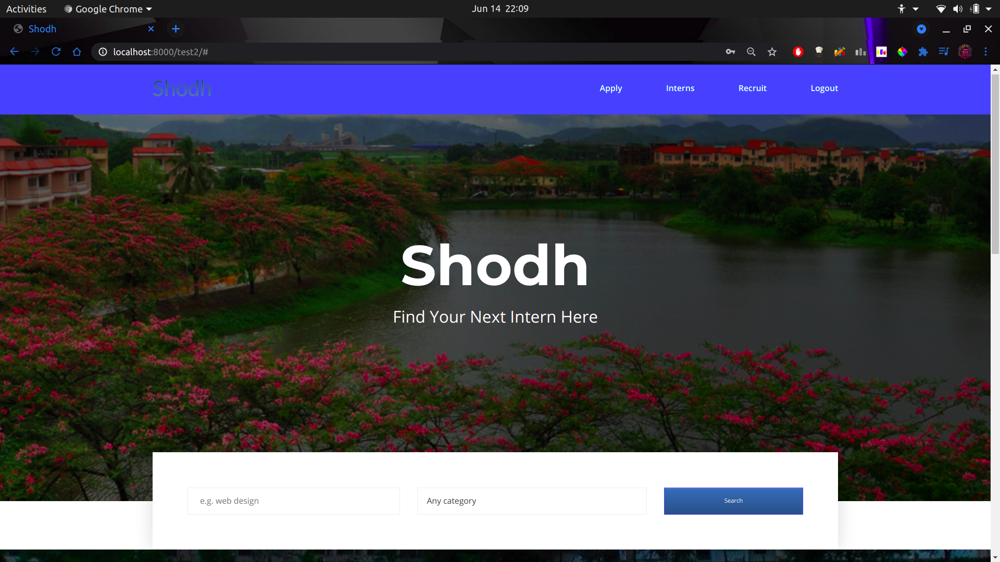

# Shodh

A project under [Students Web Committee](https://docs.swciitg.in/)

------

### About

A portal for the professors, alumni and students of IIT Guwahati to create & apply for

- Internships
- BTech. Projects
- Other Technical/Cultural Projects

### Features  : 

- Viewing all intern & projects at a glance
- **Searching** via name &  **Filtering** via type (App Dev., ML, SDE, Frontend, Backend, etc.)
- Display and view **User Profile** containing all relevant info

#### For Recruiter/Faculty
- One-stop portal for internships and projects 
- Selecting/Rejecting candidate via portal itself
- Ask details such as CPI, Skills, Resume, etc. 
- Can even ask additional questions. 
- Expected qualifications, stipend, location, etc can be posted as well 

### Screenshots

<table style="padding:10px">
  <tr>
    <td> 
				</td>
 	<td>
 		
	</td>
</tr>
  <tr>
    <td> 
				</td>
 	<td>
 		
	</td>
</tr>
  <tr>
    <td> 
				</td>
 	<td>
 		
	</td>
</tr>
</table>

### Team

- Aditya Trivedi
- Atharva Varde
- Astik Raj
- Bellamkonda Kartheek
- Dyuti Mangal
- Keshav Chourasiya
- Priyank Soni
- Tanishq Katare
